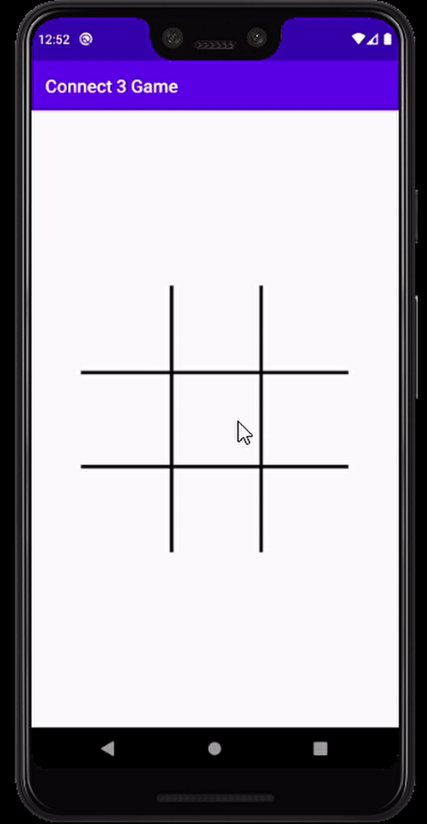

# Tic-Tac-Toe Game Mobile App



## Overview
Tic-Tac-Toe Game is an Android mobile app built using Java and Android Studio. It lets two players compete on a single device with turn-based play, win/draw detection, and engaging UI.

## Features
- Two‑player gameplay on one device with clean and interactive UI  
- Game logic for turn‑based interactions, win & draw condition detection  
- Responsive layouts for different Android screen sizes  
- Follows object‑oriented programming principles and uses Android architecture components

## Getting Started

### Prerequisites
- Android Studio (latest version recommended)  
- Java JDK (version 11 or above)  
- Android device or emulator

### Installation & Running
```bash
# Clone the repository
git clone https://github.com/Wahid-Haidari/Tic-Tac-Toe.git

# Open project in Android Studio
cd Tic-Tac-Toe/app

# Build and run
# Use Android Studio tools to build and deploy to device/emulator
```

## Project Structure
```
Tic-Tac-Toe/
├── app/                     # Android app source code
├── gradle/wrapper           # Gradle wrapper
├── .gitignore
├── connect 3 App.gif        # Demo GIF showing game in action
├── build.gradle
├── settings.gradle
└── README.md
```

## Technologies Used
- Java  
- Android Studio  
- Android Architecture Components  

## Contribution
Contributions are welcome! Feel free to open an issue or submit a pull request with improvements or features.

## License
[Add your license here: e.g., MIT, Apache‑2.0, etc.]
